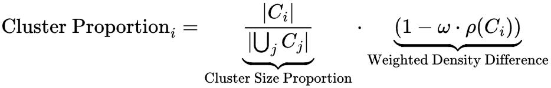

# MiniCorpus

MiniCorpus reproduces and investigates enhancements for [MiniPile (Kaddour, Jean. 2023)](https://arxiv.org/abs/2304.08442), a distilled subset of [The Pile Deduplicated](https://huggingface.co/datasets/EleutherAI/the_pile_deduplicated), related to [(Gao, et al. 2020)](https://arxiv.org/abs/2101.00027). MiniPile enables efficient LLM training using two orders of magnitude less data while aiming to maintain competitive performance compared to models trained on the full deduplicated Pile.

MiniCorpus covers the following steps:
1. Reproducing MiniPile from the deduplicated Pile from scratch using the HuggingFace libraries and PyTorch.
2. Further improving the MiniPile pipeline and creating a more effective version of MiniPile.
3. Preparing the improved pipeline for general applicability with the theoretical example of [RefinedWeb (Penedo, et al. 2023)](https://arxiv.org/abs/2306.01116).

**Key objectives of this project:**
- Quantifying the extent of performance retention in decoder-only generative language models of the [Pythia series](https://arxiv.org/abs/2304.01373) trained on MiniPile versus models pre-trained on the larger Pile, focusing on benchmark accuracy
- Developing an optimized subset of The Pile through improvements to the existing
MiniPile data filtering pipeline, and adapting this pipeline for RefinedWeb
- Investigating the role of dataset source diversity on pre-training effectiveness, especially when training token counts are low, by examining performance variations across subsets with differing kinds and degrees of content diversity.
- Examining the impact of parameter scaling on model performance when pre-trained
with reduced but representative datasets, analyzing potential trade-offs in computational efficiency versus benchmark performance.

The findings and implications of this project can be found at the end of the [Conclusion](#conclusion) section. 
The produced models and datasets can be found on [HuggingFace](https://huggingface.co/Marcus2112) and are listed further below with the [Datasets](#datasets) and [Models](#models) sections.

## Project Setup

1. Install Python
2. Install Anaconda
3. Create the project's Conda environment using: `conda env create -f minicorpus.yaml`.

## Quick Guide: Build your own MiniPile

Every script in this respository has the instructions on how to run it noted at the end of it.

1. Download [The Pile Deduplicated](https://huggingface.co/datasets/EleutherAI/the_pile_deduplicated) from HuggingFace, e.g. by using `01_get_piles.ipynb`.
2. Embed the Pile Deduplicated using `03_embed_pile_dedup_turbo.py`.
3. As `03_embed_pile_dedup_turbo.py` starts with the actual processing, run `03_cluster_pile_embed.py` to cluster the embeddings. The clustering script was built to run the fitting of k-Means in parallel with the embedding script producing new embeddings.
4. After the embedding script finishes, `03_cluster_pile_embed.py` will store the centroids and automatically start clustering the embeddings.
5. Once clustering concluded, you may inspect the generated `cluster_info_for_inspection.json` in the `MiniPile_BatchKMeans` folder for manual cluster exclusion.
6. Run `03_sort_pile_clusters.py` to have the clustered embeddings sorted by their assigned cluster into dedicated `jsonl` files.
7. Run `03_distill_pile_embed.py` or either of the `04_distill_pile_embed_*.py` scripts to sample a flavor of MiniPile from the embedded Pile.
8. *(Optional)* Run `03_train_160M_*.py` or `03_train_1.4B_*.py` or either of the `04_train_160M_*.py` or `04_train_1.4B_*.py` to train a model on your chosen MiniPile flavor. You may need to uncomment the download function inside the training script to have it download the untrained base model first.
9. *(Optional)* Use `00_pile_pusher.py` to push any of the artifacts you produced to your HuggingFace account.

## Reproducing MiniPile

Reproduction of MiniPile's assembly is necessary to form a basis for attempts at improving it. The reproduction process is split across three chapters.
Files belonging to these chapters are prefixed with `01_`, `02_`, and `03_` respectively. 
Jupyter Notebooks are added for each chapter for documentation and guidance.

- Chapter `01` is concerned with downloading The Pile Deduplicated and the original MiniPile as baseline. Be sure to have enough disk space available.
    - The guide is available in the Jupyter Notebook `01_get_piles.ipynb`.
- Chapter `02` regards training a [Pythia](https://arxiv.org/abs/2304.01373) [160M](https://huggingface.co/EleutherAI/pythia-160m-deduped) model on the original MiniPile and benchmarking it in zero-shot settings with the [EleutherAI LM Evaluation Harness](https://github.com/EleutherAI/lm-evaluation-harness). 
    - The guide is available in the Jupyter Notebook `02_eval_160M.ipynb`.
- Chapter `03` is about reproducing MiniPile from scratch. This includes embedding the deduplicated Pile, clustering the embeddings, and sampling a MiniPile from the clusters in accordance with the [MiniPile paper](https://arxiv.org/abs/2304.08442).

We deem our reproduction of MiniPile successful. 
However, we had to make compromises and assumptions:
1. For embedding, [E5-Large](https://huggingface.co/intfloat/e5-large) was replaced with [E5-Base-4k](https://huggingface.co/dwzhu/e5-base-4k), which is smaller and faster, but [reported to perform worse](https://mono.software/2024/11/07/testing-embedding-models-rag/) than E5-Large representation-wise. We addressed this by raising the context window size from E5-Large's default 512 tokens to 1024 tokens. Furthermore, we deviate from the default model by employing scaled dot-product attention for E5-Base-4k, because it was found to further accelate inference.
2. Cluster exclusion was done manually, as per paper. While we found and excluded the exact same amount of clusters with the same clusters described as examples by the paper, differences in cluster selection may have occured.

The reproduction dataset showed deviations from the benchmark results produced for MiniPile. These were observed both in the positive and negative direction on the 160M architecture. Results on ARC-Challenge and MMLU deteriorated by 10.9% and 15% respectively, while HellaSwag, WinoGrande and BLiMP improved in the single digit percentage range. However, Lambada perplexity scores were reduced by 38.9% Lambada (OpenAI) and 55% Lambada (Std). This indicates that the produced dataset may be tilted in a slightly different direction content-wise due to embeddings or cluster selection. The single digit percentage point improvements witnessed on a majority of the benchmarks lead us to conclude that the reproduction is within the margin of error and therefore successful.

## Improving the MiniPile Pipeline, Practically

The MiniPile pipeline can be improved by sampling a data subset that is ideally even smaller than MiniPile and yet more representative of the original Pile Deduplicated. 
Ultimately resulting in success, several attempts were undertaken to improve the MiniPile pipeline for these objectives. 
All individual ideas are documented extensively in the fourth chapter's Jupyter Notebook [`04_improve_minipile.ipynb`](./04_improve_minipile.ipynb), which lays out the intentions and reasonings more thoroughly. The following ideas (and ablation studies) were conducted:

1. Cluster-Proportionate Sampling (`04_distill_pile_embed_idea_1_proportionate.py`)
2. Hybrid Loss-Based Sampling (`04_distill_pile_embed_idea_2_lossi_1.py` and `04_distill_pile_embed_idea_2_lossi_2.py`)
3. Size-Density-Proportionate Sampling (`04_distill_pile_embed_idea_3_density.py`) 
3.1. Low-Density-Proportionate Sampling (`04_distill_pile_embed_idea_3.1_density_low.py`)
4. Higher-Resolution Clustering (`04_cluster_pile_embed_idea_4_double.py`, `04_distill_pile_embed_idea_4_k440.py`)
5. Higher-Resolution Clustering and Size-Density-Proportionate Sampling (`04_distill_pile_embed_idea_5_k440_density.py`)
6. Inter-Intra-Cluster Sampling with High Clustering Resolution (`04_distill_pile_embed_idea_6_inter.py`) 
6.1. Inter-Intra-Cluster Sampling with Inter-Cluster Diversity Weighting Increased (`04_distill_pile_embed_idea_6.1_inter_high.py`)
7. Down-Sized Size-Density-Proportionate Sampling (`04_distill_pile_embed_idea_7_density-tiny.py`, `04_distill_pile_embed_idea_7_density-nano.py` and `04_distill_pile_embed_idea_7_density-pico.py`)

Zero-shot benchmark results can be found further below. 
We deem the **Size-Density-Proportionate Sampling** (Idea 3) the most impactful idea regarding the fullfilling of our project targets, as it is more representative of the original Pile Deduplicated while being smaller in example count than MiniPile. Compared to the reproduction, improvements were observed on the WinoGrande, ARC-Challenge and BLiMP benchmarks. This approach was further investigated in (Ideas 7, 8, 9) to reduce the distilled, density-sampled dataset size to 90% (Idea 7) of the dataset created in (Idea 3), and then fruther to 75% (Idea 8) as well as 25% (Idea 9) of the original MiniPile size, respectively.

### Size-Density-Proportionate Sampling

Like the other ideas, this improvement idea and its inception were extensively documented in [`04_improve_minipile.ipynb`](./04_improve_minipile.ipynb). 
As this approach provided the most interesting results, it is briefly layed out here:

Size-density-proportionate sampling is a specific setting applied to the density-based sampling idea, which calculates cluster contribution proportions to the distilled target dataset like so:

Here, $|C_i|$ is the number of documents in cluster $i$, $|\bigcup_{j} C_j|$ is the total number of documents in all non-excluded clusters, and $\rho(C_i)$ is the density of cluster $i$. Per cluster, the density is calculated by finding the distance from each data point in this cluster to its centroid, adding up all these distances and dividing the sum by the number of data points in the cluster. The impact of the density is scaled by the hyperparameter $\omega$ with the intention of allowing to reduce a risk of over-representation of overly sparse clusters compared to more example-rich or even dense, yet still informative regions in the embedding space. Assume $\omega$ to take on the role of a diversity amplifier. For size-density-proportionate sampling, we set $\omega = 0.5$.

#### Reasoning behind this idea

Density-proportionate sampling as a concept emphasizes the sampling from regions with higher diversity, i.e. lower-density areas/clusters with higher example counts, as well as the sampling from overall larger clusters. 
The idea was inspired by the concept of entropy in that these regions, when explicitly regarded, enable to provide deeper, richer insight into larger subspaces of the embedding space covered by the original dataset. Hence, capturing samples from a measure of density may help cover more area of the occupied embedding space with an ultimately smaller data subset. And, as embeddings represent text contents, capturing from lower-density areas implies that the individual texts themselves are more diverse. 
Therefore, a penalty on high-density 'oversampling' is put in place through $\omega$ to reduce semantic redundancy in the sampled subset. 
Over-emphasizing this penalty would however lead to a loss of information, as dense regions may be dense specifically because of the region's semantic information being particularly important/informative and thus captured more often. For the particular approach of size-density-proportionate sampling, $\omega$ was set to 0.5 to have both dense, representative regions, as well as sparse, diverse regions, explicitly captured. Note that $\omega$ doesn't weigh one factor (cluster size) against the other (cluster density), and rather the density factor is scaled by $\omega$. Note also that we perform this per cluster as to make sure we still represent each of the non-excluded clusters in the final dataset, and not having the sampling from one subset of clusters leading to ignoring other clusters entirely.

As it was a goal to produce a smaller, more retaining/representative version of MiniPile, this approach was scaled to produce successively even smaller versions of the distilled dataset. One of the ablation studies, "MiniPile Density Pico", was trained on the 160M and the [1.4B Pythia](https://huggingface.co/EleutherAI/pythia-1.4b-deduped) model architectures and showed surprising results on both, which are further discussed in the [Interpretation on practical improvements](#interpretation-on-practical-improvements) section. It is these results combined with the above initial positive feedback that led us to the conclusion that the size-density-proportionate sampling approach is the most interesting and impactful idea, fullfilling the requirement of producing a smaller, yet more representative version of MiniPile.

## Benchmark Results

Detailed results can be found in the [benchmarks](./benchmarks/) folder. 
Benchmark comparisons were additionally documented in the [MiniPile_Pile_Benchmark_Comparisons.ods](./MiniPile_Pile_Benchmark_Comparisons.ods) spreadsheet and across the fourth chapter's Jupyter Notebook. We conducted a little more rigorous statistical analysis there, too. 
All benchmarks indicate zero-shot performance. 
(markdown tables below for readability) 
LaTeX-versions of the benchmark tables can be found in the [benchmark_results.pdf](./img/benchmark_results.pdf). 

### Pythia 160M models

| Model                   | ARC-Challenge (acc) | ARC-Challenge (stddev) | MMLU (acc) | MMLU (stddev) | HellaSwag (acc) | HellaSwag (stddev) | WinoGrande (acc) | WinoGrande (stddev) | Lambada (OpenAI) (acc) | Lambada (OpenAI) (stddev) | Lambada (OpenAI) (perplexity) | Lambada (OpenAI) (stddev) | Blimp (acc) | Blimp (stddev) | Lambada (Std) (acc) | Lambada (Std) (stddev) | Lambada (Std) (perplexity) | Lambada (Std) (stddev) |
|-------------------------|---------------------|-------------------------|------------|---------------|-----------------|--------------------|------------------|---------------------|-------------------------|----------------------------|-----------------------------|---------------------------|-------------|----------------|---------------------|-------------------------|----------------------------|--------------------------|
| 160M Pile Dedup         | 0.200              | 0.012                  | 0.230      | 0.004         | 0.290           | 0.005             | 0.496            | 0.014              | 0.369                   | 0.007                     | 31.259                      | 1.159                     | 0.729       | 0.002          | 0.234               | 0.006                  | 172.762                    | 7.727                   |
| 160M MiniPile           | 0.213              | 0.012                  | 0.270      | 0.004         | 0.256           | 0.004             | 0.472            | 0.014              | 0.000                   | 0.000                     | 3033175.269                 | 288926.583               | 0.519       | 0.002          | 0.000               | 0.000                  | 27067951.346               | 2710040.191             |
| 160M Reproduction       | 0.189              | 0.012                  | 0.230      | 0.004         | 0.260           | 0.004             | 0.512            | 0.014              | 0.000                   | 0.000                     | 1854408.400                 | 148101.598               | 0.548       | 0.002          | 0.000               | 0.000                  | 11927123.251               | 1063672.928             |
| 160M Lossi              | 0.198              | 0.012                  | 0.230      | 0.004         | 0.260           | 0.004             | 0.511            | 0.014              | 0.000                   | 0.000                     | 2116445.173                 | 175403.058               | 0.549       | 0.002          | 0.000               | 0.000                  | 14896599.925               | 1366937.547             |
| 160M Density            | 0.192              | 0.012                  | 0.230      | 0.004         | 0.260           | 0.004             | 0.520            | 0.014              | 0.000                   | 0.000                     | 2099002.091                 | 170652.622               | 0.550       | 0.002          | 0.000               | 0.000                  | 13347273.608               | 1997894.636             |
| 160M k440               | 0.197              | 0.012                  | 0.230      | 0.004         | 0.262           | 0.004             | 0.511            | 0.014              | 0.000                   | 0.000                     | 1854900.791                 | 147593.481               | 0.547       | 0.002          | 0.000               | 0.000                  | 11658172.431               | 1033012.414             |
| 160M k440 Density       | 0.193              | 0.012                  | 0.230      | 0.004         | 0.260           | 0.004             | 0.494            | 0.014              | 0.000                   | 0.000                     | 2025523.777                 | 164221.889               | 0.552       | 0.002          | 0.000               | 0.000                  | 12959844.941               | 1160155.065             |
| 160M k440 Inter         | 0.194              | 0.012                  | 0.230      | 0.004         | 0.261           | 0.004             | 0.500            | 0.014              | 0.000                   | 0.000                     | 1858348.205                 | 147853.142               | 0.551       | 0.002          | 0.000               | 0.000                  | 11655568.314               | 1032438.429             |

### Pythia 160M ablation studies

| Model                        | ARC-Challenge (acc) | ARC-Challenge (stddev) | MMLU (acc) | MMLU (stddev) | HellaSwag (acc) | HellaSwag (stddev) | WinoGrande (acc) | WinoGrande (stddev) | Lambada (OpenAI) (acc) | Lambada (OpenAI) (stddev) | Lambada (OpenAI) (perplexity) | Lambada (OpenAI) (stddev) | Blimp (acc) | Blimp (stddev) | Lambada (Std) (acc) | Lambada (Std) (stddev) | Lambada (Std) (perplexity) | Lambada (Std) (stddev) |
|------------------------------|---------------------|-------------------------|------------|---------------|-----------------|--------------------|------------------|---------------------|-------------------------|----------------------------|-----------------------------|---------------------------|-------------|----------------|---------------------|-------------------------|----------------------------|--------------------------|
| 160M Low Density            | 0.189              | 0.011                  | 0.230      | 0.004         | 0.251           | 0.004             | 0.507            | 0.014              | 0.000                   | 0.000                     | 2287598.555                 | 192724.615                | 0.550       | 0.017          | 0.000               | 0.000                  | 16223747.059                | 1503858.305             |
| 160M k440 Inter High        | 0.191              | 0.012                  | 0.230      | 0.004         | 0.261           | 0.004             | 0.519            | 0.014              | 0.000                   | 0.000                     | 1976271.166                 | 158805.423                | 0.544       | 0.002          | 0.000               | 0.000                  | 12395759.927                | 1104763.293             |
| 160M Density Tiny (842k)    | 0.184              | 0.011                  | 0.230      | 0.004         | 0.260           | 0.004             | 0.498            | 0.014              | 0.000                   | 0.000                     | 1934160.402                 | 153855.866                | 0.536       | 0.002          | 0.000               | 0.000                  | 10354382.844                | 900493.008              |
| 160M Density Nano (750k)    | 0.193              | 0.012                  | 0.230      | 0.004         | 0.260           | 0.004             | 0.504            | 0.014              | 0.000                   | 0.000                     | 1871303.218                 | 150515.641                | 0.536       | 0.002          | 0.000               | 0.000                  | 10513877.858                | 926264.339              |
| 160M Density Pico (250k)    | 0.190              | 0.012                  | 0.230      | 0.004         | 0.258           | 0.004             | 0.496            | 0.014              | 0.000                   | 0.000                     | 1964196.926                 | 153419.785                | 0.538       | 0.002          | 0.000               | 0.000                  | 10720344.552                | 925236.704              |
| 160M Density 2 Epochs       | 0.189              | 0.012                  | 0.230      | 0.004         | 0.257           | 0.004             | 0.501            | 0.014              | 0.000                   | 0.000                     | 1587737.376                 | 121555.315                | 0.538       | 0.002          | 0.000               | 0.000                  | 8366924.760                 | 713077.358              |
| 160M Density Pico 2 Epochs  | 0.193              | 0.012                  | 0.230      | 0.004         | 0.257           | 0.004             | 0.493            | 0.014              | 0.000                   | 0.000                     | 2017680.705                 | 159090.061                | 0.541       | 0.002          | 0.000               | 0.000                  | 10465698.688                | 903166.520              |

### Pythia 1.4B models

| Model                         | ARC-Challenge (Acc) | ARC-Challenge (Stddev) | MMLU (Acc) | MMLU (Stddev) | HellaSwag (Acc) | HellaSwag (Stddev) | WinoGrande (Acc) | WinoGrande (Stddev) | Lambada (OpenAI Acc) | Lambada (OpenAI Stddev) | Lambada (OpenAI Perplexity) | Lambada (OpenAI Perplexity Stddev) | Blimp (Acc) | Blimp (Stddev) | Lambada (Std Acc) | Lambada (Std Stddev) | Lambada (Std Perplexity) | Lambada (Std Perplexity Stddev) | ARC-Easy (Acc) | ARC-Easy (Stddev) |
|-------------------------------|---------------------|-------------------------|------------|---------------|-----------------|---------------------|-------------------|-----------------------|------------------------|---------------------------|------------------------------|-----------------------------------|-------------|----------------|-------------------|----------------------|--------------------------|-------------------------------|---------------|-----------------|
| 1.4B Pile Dedup           | 0.260               | 0.013                   | 0.239      | 0.004         | 0.418           | 0.005               | 0.573             | 0.014                 | 0.620                  | 0.007                     | 6.104                        | 0.153                             | 0.815       | 0.001          | 0.490             | 0.007                | 11.245                  | 0.331                         | 0.617         | 0.010           |
| 1.4B MiniPile             | 0.190               | 0.012                   | 0.230      | 0.004         | 0.258           | 0.004               | 0.519             | 0.014                 | 0.000                  | 0.000                     | 1564928.526                  | 118691.457                       | 0.548       | 0.002          | 0.000             | 0.000                | 8848600.941             | 745031.890                    | 0.272         | 0.009           |
| 1.4B Reproduction         | 0.193               | 0.012                   | 0.230      | 0.004         | 0.258           | 0.004               | 0.509             | 0.014                 | 0.000                  | 0.000                     | 1520707.870                  | 115261.366                       | 0.540       | 0.002          | 0.000             | 0.000                | 8651201.888             | 735161.524                    | 0.267         | 0.009           |
| 1.4B Density              | 0.185               | 0.011                   | 0.230      | 0.004         | 0.259           | 0.004               | 0.504             | 0.014                 | 0.000                  | 0.000                     | 1420846.832                  | 106563.133                       | 0.542       | 0.002          | 0.000             | 0.000                | 7916035.353             | 664805.918                    | 0.270         | 0.009           |
| 1.4B Density Pico (250k)  | 0.193               | 0.012                   | 0.230      | 0.004         | 0.260           | 0.004               | 0.512             | 0.014                 | 0.000                  | 0.000                     | 1662608.944                  | 128444.361                       | 0.545       | 0.002          | 0.000             | 0.000                | 8546578.183             | 737889.944                    | 0.276         | 0.009           |

## Interpretation on practical improvements

With this project, we replicated the MiniPile pipeline, produced a reproduction dataset and attempted several ideas for improvement of the distillation pipeline, which we then compared primarily by training and benchmarking the 160M Pythia decoder-only model architecture.

### Reproduction Challenges and Insights

Even though the reproduction had to make assumptions and compromises, target benchmark performance was largely attained or lightly improved upon. We consider this to be within the margin of error. The reproduction of MiniPile was therefore deemed successful. Lessons learned for the reproduction primarily concern aspects of technical implementation. For example, during test runs, execution time for the distillation script was reduced from ~47 hours to ~3 hours. Additional 4 days of processing time were saved by implementing embedding and clustering efforts to run in an offset, parallel fashion to one another. The replacement of [E5-Large](https://huggingface.co/intfloat/e5-large) with [E5-Base-4k](https://huggingface.co/dwzhu/e5-base-4k) further sped up the distillation pipeline (by ~1 week) without compromising on resulting performance.

### 160M Benchmark Insights

The project produced a Pythia 160M and a Pythia 1.4B trained on the original MiniPile as baselines. 
Additionally, the project produced six Pythia 160M models exploring distinct ideas for improvement and another seven Pythia 160M ablation models, concerning investigations of scaling effects of distillation parameters, the distillation dataset size and the training step count. An additional three 1.4B parameter models were trained with the reproduction MiniPile, the most promising distillation candidate (size-density-weighted sampling) and the lowest example count distillation dataset (size-density-weighted pico), respectively. A total of 14 datasets has been released on [HuggingFace](https://huggingface.co/Marcus2112), along with [all trained models](https://huggingface.co/collections/Marcus2112/minicorpus-6786d549d80a994a21989c5a). (Individual links to models and datasets are listed further below.)

For the 160M model benchmarks, we see that all of the 'improved' MiniPile model variants maintain similar MMLU performance (0.230, which is slightly worse than random guessing at 0.250), undercutting the original MiniPile (0.270) slightly. WinoGrande shows high consistency across MiniPile model variants, too. Compared to the Pile-trained model, every MiniPile model variant indicates catastrophic failure on both versions of Lambada, with perplexity scores in the millions. However, Blimp scores show only moderate degradation from the Pile-trained baseline, indicating a high retention of reasoning capabilities.

The 160M MiniPile baseline shows highest MMLU (0.270) and competitive ARC-Challenge scores (0.213), while 160M Density shows best WinoGrande (0.520) and solid Blimp (0.550) scores, and at the same time being approx. 6% smaller in training example count compared to MiniPile, and 13% smaller in memory footprint than the MiniPile reproduction.

Of the attempted improvements, the "Low Density" version shows overall lowest scores, beating the reproduction only slightly in the Blimp benchmark.
This implies that it is important to enforce capturing diversity, but to also still sufficiently capture dense, similar regions of data instead of overly prefering sparse, unique example regions.

When solely regarding the 160M results, one could interpret that:
- Dataset size scales with core capabilities, but only to a disproportionately lower degree
- Quality and representation capability of examples matters more than quantity
- Dense regions of data contain learning signal, while sparse regions contain diversity, which we also have to make sure to consider and include

Notably, Density Tiny, Nano and Pico versions show performance degradation, but this effect turns out surprisingly minimal.

Again, considering only the 160M results, one could think that this would be due to:
- The deduplicated Pile potentially still containing duplicates, granting the maintaining of signal strength on smaller subsets
- Size-density-proportionate sampling identifying truly fundamental examples that encode key patterns
- Model capacity as a limiting factor rather than data, and therefore larger datasets or longer training runs may lead the 160M architecture to overfit

### 160M Step Count Ablation Studies

Two ablation studies on 160M Density and 160M Density Pico were conducted with an increased step count from the original 1.5 to now 2 epochs each.
If the compressed datasets truly were to contain more concentrated, representative knowledge, then:

1. If the model hasn't reached its architectural capacity limit:
    - Additional training epochs would allow it to better absorb the concentrated information
    - We would see improved or at worst equal benchmark results (indicating a plateau)
2. If we have the model already at its architectural capacity limit:
    - Additional training would lead to overfitting
    - We would see deteriorating benchmark results

The test revealed nuances: For 160M Density Pico on two epochs, we observe stable performance with most score changes below 1%. Accuracy and perplexity scores alike show signs both of improvement and degradation. This stability across metrics suggests the 160M model reached an optimal point in its learning capacity at just 488 steps, instead of the original 1024 used for MiniPile-scale training. 
The picture evolves when we examine 160M Density on two epochs at 1366 steps. Here, we observe a clear pattern of overfitting on reasoning tasks, yet intriguingly, the model shows substantial improvements in perplexity scores too.

From that, we derive:
1. More training on the distilled MiniPile Density dataset leads to selective overfitting - while the model's language modeling capabilities (measured by perplexity) continue to improve, its performance on reasoning tasks deteriorates.
2. The smaller MiniPile Density Pico dataset appears to provide an actually more concentrated learning signal, reaching optimal performance earlier and maintaining stability with extended training and even improving on perplexity scores compared to the standard training setup for the bigger MiniPile Density.
3. Dataset size reduction, at least for The Pile Deduplicated as base, may actually serve as a regularizer, helping prevent overfitting on reasoning tasks while maintaining core language modeling capabilities.

At 160M parameters, the models can effectively learn from this concentrated form of the data without overfitting, possibly because, as we observed, the reduced dataset matches better with what a 160M model can absorb and utilize. When we scale up to 1.4B parameters, this same "compression" becomes a critical limitation - the larger models have the capacity to learn more complex patterns and relationships that were filtered out by the sampling processes.

### 1.4B Results and Revision of Hypotheses

1.4B Pile Deduplicated shows major improvements over 160M Pile Deduplicated across all metrics. However, like the original MiniPile, none of the new sampling approaches successfully preserve the qualities that enable scaling retained knowledge with model size. Moreover, none of the MiniPile variants of 1.4B show notable improvements to their 160M counterparts, but instead indicate occasional slight degradation. While training on the Pile Deduplicated has scores effectively scale with model size (e.g., HellaSwag: 0.29 to 0.418), all MiniPile variants miss out on this effect and fail to leverage increased model capacity. HellaSwag stays at ~0.26, size-density-proportionate sampling had seen 0.520 on 160M WinoGrande, but this even got reduced to 0.504 on 1.4B. These results strongly suggest that optimal training of large models requires substantially more, diverse data than any of the sampling methods preserve, particularly for capturing the patterns that larger models can 'comprehend' and leverage.

Ignoring the results for 1.4B Pile Deduplicated for a moment, we also see another effect: The performance differences between the different MiniPile versions diminish, with the size-density-proportionate sampling approach not being a clear improvement at all anymore, but instead being just marginally better only in HellaSwag and both Lambada perplexity scores.

Therefore, other than the 160M benchmark results alone would let suggest, there exists a more distinct, complex relationship between dataset size and model capacity when training parameter counts are scaled up. From this perspective, the MiniPile variants seem to be creating a "distilled" or "compressed" version of the Pile's knowledge that is particularly well-suited for smaller model capacities.

This was further investigated with with a training run of 1.4B Pythia on "MiniPile Density Pico", which produced surprising results:

| Benchmark        | Measure    |     | 1.4B Density                   | 1.4B Density Pico          | Percentage Difference in Means |
| ---------------- | ---------- | --- | ------------------------------ | -------------------------- | ------------------------------ |
| ARC-Challenge    | acc        | ↑   | 0.1852 ± 0.0114                | **0.1928 ± 0.0115**        | 4.1037                         |
| MMLU             | acc        | ↑   | 0.2295 ± 0.0035                | 0.2295 ± 0.0035            | 0.0000                         |
| HellaSwag        | acc        | ↑   | 0.2589 ± 0.0044                | **0.2600 ± 0.0044**        | 0.4249                         |
| WinoGrande       | acc        | ↑   | 0.5043 ± 0.0141                | **0.5122 ± 0.0140**        | 1.5665                         |
| Lambada (OpenAI) | acc        | ↑   | 0.0000 ± 0.0000                | 0.0000 ± 0.0000            | -                              |
| Lambada (OpenAI) | perplexity | ↓   | **1420846.8323 ± 106563.1327** | 1662608.9444 ± 128444.3607 | 17.0154                        |
| Lambada (Std)    | acc        | ↑   | 0.0000 ± 0.0000                | 0.0000 ± 0.0000            | -                              |
| Lambada (Std)    | perplexity | ↓   | **7916035.3527 ± 664805.9178** | 8543578.1832 ± 737889.9436 | 7.9654                         |
| BLiMP            | acc        | ↑   | 0.5422 ± 0.0017                | **0.5445 ± 0.0017**        | 7.9654                         |
| ARC-Easy         | acc        | ↑   | 0.2698 ± 0.0091                | **0.2761 ± 0.0091**        | 2.3351                         |

The Density-based sampling approach's distillation size reduction not only shows competitive performance, but it beats the original size-density proportionate dataset in nearly all reasoning benchmarks, with a disproportionally small increase on the perplexity scores. 
Furthermore, among all distillates trained on 1.4B (including the original MiniPile), Density Pico delivers best ARC-Challenge scores, 
best HellaSwag scores and best ARC-Easy scores, at a quarter of MiniPile's size.
 
At 1.4B parameters, we can observe the size restriction act as a means of regularization: Essential knowledge transfer mechanisms remain intact, but at the cost of a reduced memorization capacity. There appears to be some optimal data-to-parameter ratio that balances feature extraction efficiency by the distillation, and memorization capacity and reasoning capability attainable by the model. This would allow for a possibility of tuning dataset size based on target application which could be especially interesting e.g. for curriculum learning approaches.

We conclude that the relationship between dataset size and model performance is not monotonic, as would be suggested by the 160M results alone. Instead, the results signal that complex, task-dependent high scores are attainable with less data than previously hypothesized with MiniPile. There seem to be attainable, optimal data-to-parameter ratios, and they seem to require less data than previously thought.

With the 1.4B results, we have to revise the 160M result interpretations and have to hypothesize that:
- The strong 160M MiniPile performances likely indicate a model-side capacity bound, rather than solely reflecting a distillate's efficiency
- The small performance gaps to The Pile Deduplicated at 160M scale could be misleading about distillate quality
- The Tiny/Nano/Pico versions may just have made the individual examples more digestible to the smaller 160M model, but have then been shown on 1.4B with Pico to actually retain better quality examples, indiciating that an essential knowledge transfer can happen with much smaller dataset subsets after all.

At larger scale, none of the sampling methods come close to full dataset performance. The 1.4B results suggest that proxy-based geometric sampling as performed by MiniPile may be insufficient for building truly scalable, hollistically preserving, distilled data subsets.

### Conclusion

With a successful replication and several different improvement approaches explored, a notable improvement was found with the [minipile_density-proportioned](https://huggingface.co/datasets/Marcus2112/minipile_density-proportioned) (Idea 3). This dataset is smaller than MiniPile, but shows competitive performance on all benchmarks.

The behaviors across 160M and 1.4B architectures suggest that looking at smaller models alone is misleading when evaluating dataset distillation techniques. The relationship between factors like dataset size, training duration, and model capacity is more complex than initially thought. In this regime, the Density sampling approach appears highly effective when combined with aggressive dataset size reduction, both on 160M and 1.4B. 

**Summarizing the key findings:**
1. Dataset distillation effectiveness cannot be properly evaluated using only individual architectures (like small 160M parameters). These models may be hitting architectural capacity limits that mask true implications of data reduction by overfitting.
2. Distilled datasets can work well with smaller models, however, they fundamentally fail to preserve patterns and relationships needed for larger models to achieve competitive capabilities. The 1.4B models demonstrated an inability to match the Pile Dedup performance, regardless of the employed sampling method.
3. Reducing the distillate size can serve as a regularizer against overfitting, as epoch count increases, helping in preserving reasoning capabilities.
4. Within the Pythia 160M model family, the optimal dataset size may actually be smaller than previously assumed with MiniPile, as signs of overfitting could be observed, and saturation was witnessed with earlier steps. 
5. The suggested best sampling approach, i.e. weight-density-based sampling, is a promising candidate for further exploration, especially when combined with aggressive dataset size reduction. Improvements could be witnessed both across 160M and 1.4B trainings.
6. The relationship between dataset size and model performance cannot be deemed monotonic. Surprisingly, even at 1.4B scale, the heavily size-reduced Density Pico showed better reasoning capabilities than four times larger distillations while maintaining only lightly lower perplexity scores. This suggests there are complex, hidden, task-dependent optima in data-to-parameter ratios that may be attainable with substantially lower sample counts than previously thought. Based on the flat-out worse distillation performances though, we can't expect these optima alone to suffice in replacing the full dataset. They might be interesting for e.g. curriculum learning approaches, though.
7. Based on 6, we suggest that current proxy- and proximity-based geometric sampling approaches like MiniPile may be fundamentally discovering the interplay between data and model capacity, but are themselves, just yet, insufficient for creating smaller, truly representative datasets across all model sizes.

## Improving the MiniPile Pipeline, Theoretically

All of the above improvements and modifications aim to be specifically applicable within resource-constrained (e.g. academic) environments. 
At a minimum, only the disk space for The Pile Deduplicated, its embedded version (I create a copy of Pile Deduplicated because I want to ensure index consistency), the clustering results and the MiniPile you want to sample from it are required. You will need a rather recent consumer-grade (CUDA-supporting) GPU for the embedding and clustering steps, but the sampling can again be done on a CPU-only machine.

Imposing this constraint for accessibility naturally limits the reachable improvement space for the MiniPile pipeline. 
The `04_improve_minipile.ipynb` notebook contains a theoretical section that discusses more fundamental improvements that could be made if the resource constraint was lifted. 
These theoretical improvements for assembly are:

- "Sparse Sampling of Embeddings with Similarity Hashing", related to:
    - [Locality Sensitive Hashing (LSH): The Illustrated Guide (pinecone.io)](https://www.pinecone.io/learn/series/faiss/locality-sensitive-hashing/)
    - [Embedding Compression with Hashing for Efficient Representation Learning in Large-Scale Graph (Yeh, et al. 2022)](https://arxiv.org/pdf/2208.05648)
    - [Hashing for Similarity Search: A Survey (Wang, et al. 2014)](https://arxiv.org/pdf/1408.2927)
    - [Efficient Measures for Processing and Exploring Large-Scale Data Domains (Reinbold, Christian. 2022)](https://mediatum.ub.tum.de/doc/1655492/ptz317jfxiatpjlwxrpcuimu1.2022-11-01_einreichung_mediatum_titelblatt_neu.pdf)

- "Double-Proxied Cross-Entropy-based Sampling", related to:
    - [Extracting representative subset from extensive text data for training pre-trained language models (Suzuki, et al. 2023)](https://www.sciencedirect.com/science/article/pii/S0306457322003508)

- "Semantic Deduplication as Post-Processing for the distilled dataset", related to:
    - [SemDeDup: Data-efficient learning at web-scale through semantic deduplication (Abbas, et al. 2023)](https://arxiv.org/pdf/2303.09540)

- "Reinforcement Learning-based sampling", related to:
    - [Data Valuation using Reinforcement Learning (Joon, et al. 2019)](https://arxiv.org/abs/1909.11671)
    - [Mastering Diverse Domains through World Models (Hafner, et al. 2023)](https://arxiv.org/abs/2301.04104)

## RefinedWeb and Preparing for General Applicability

The final step of the MiniCorpus project is to prepare the optimized pipeline for general applicability with the example of RefinedWeb. 
The RefinedWeb dataset is a subset of the CommonCrawl dataset that was filtered and deduplicated. 
However, RefinedWeb is not a clear sum of diverse, smaller datasets like The Pile Deduplicated. 
Therefore, we have to find a way to lift the need for $k$-Means clustering, which was based on knowledge of the Pile's assembly, and instead use a more general approach to sample a MiniRefinedWeb.
The mending and adapting of the pipeline for RefinedWeb is documented in the Jupyter Notebook `05_refinedweb_pipeline.ipynb`.

## Produced Artifacts

- Go with [minipile_density-proportioned](https://huggingface.co/datasets/Marcus2112/minipile_density-proportioned) if you want to attain improved benchmark results with lower than 1M examples.
- Go with [minipile_density-proportioned_pico](https://huggingface.co/datasets/Marcus2112/minipile_density-proportioned_pico) if you want to attain largely similar benchmark results to the original MiniPile with 250k examples.

### Datasets

- [pile_dedup_embeddings_clusters_k220](https://huggingface.co/datasets/Marcus2112/pile_dedup_embeddings_clusters_k220)
    - contains the idx from The Pile Deduplicated, the associated cluster, and the embedding's distance to the cluster centroid, for each embedding, from a clustering with $k=220$.
- [minipile_reproduction](https://huggingface.co/datasets/Marcus2112/minipile_reproduction)
    - contains the text and pile idx per document of the reproduction of MiniPile.
- [minipile_cluster-proportioned](https://huggingface.co/datasets/Marcus2112/minipile_cluster-proportioned)
    - contains the text and pile idx per document of a MiniPile that was sampled proportionally to the cluster sizes.
- [minipile_loss-sampled](https://huggingface.co/datasets/Marcus2112/minipile_loss-sampled)
    - contains the text and pile idx per document of a MiniPile that was sampled proportionally to the loss of $n=1000$ embeddings per cluster.
- [minipile_density-proportioned](https://huggingface.co/datasets/Marcus2112/minipile_density-proportioned)
    - contains the text and pile idx per document of a MiniPile that was cluster-wise sampled from proportionally to an equally weighted factor of cluster density and cluster size.
- [minipile_low-density-proportioned](https://huggingface.co/datasets/Marcus2112/minipile_low-density-proportioned)
    - contains the text and pile idx per document of a MiniPile that was cluster-wise sampled from proportionally to a weighted factor of cluster density and cluster size, but biased towards sampling from lower density clusters. We set $\omega = 0.75$.
- [pile_dedup_embeddings_clusters_k440](https://huggingface.co/datasets/Marcus2112/pile_dedup_embeddings_clusters_k440)
    - contains the idx from The Pile Deduplicated, the associated cluster, and the embedding's distance to the cluster centroid, for each embedding, from a clustering with $k=440$.
- [minipile_k440](https://huggingface.co/datasets/Marcus2112/minipile_k440)
    - contains the text and pile idx per document of a MiniPile reproduced with a clustering of $k=440$.
- [minipile_k440_density-proportioned](https://huggingface.co/datasets/Marcus2112/minipile_k440_density-proportioned)
    - contains the text and pile idx per document of a MiniPile that was cluster-wise sampled from proportionally to an equally weighted factor of cluster density and cluster size, with a clustering of $k=440$.
- [minipile_k440_inter-density-proportioned](https://huggingface.co/datasets/Marcus2112/minipile_k440_inter-density-proportioned)
    - contains the text and pile idx per document of a MiniPile that was cluster-wise sampled from proportionally to an equally weighted set of factors of cluster density, cluster size and inter-cluster diversity, with a clustering of $k=440$.
- [minipile_k440_high-inter_density](https://huggingface.co/datasets/Marcus2112/minipile_k440_high-inter_density)
    - contains the text and pile idx per document of a MiniPile that was cluster-wise sampled from proportionally to an unequally weighted set of factors of cluster density, cluster size and a higher weighted inter-cluster diversity, with a clustering of $k=440$.
- [minipile_density-proportioned_tiny](https://huggingface.co/datasets/Marcus2112/minipile_density-proportioned_tiny)
    - contains the text and pile idx per document of a MiniPile that was cluster-wise sampled from proportionally to an equally weighted factor of cluster density and cluster size, reduced in total example count to 90% of the above density-proportioned MiniPile.
- [minipile_density-proportioned_nano](https://huggingface.co/datasets/Marcus2112/minipile_density-proportioned_nano)
    - retaining 75% of the original MiniPile example count, sampled with size-density-proportionate sampling at $\omega = 0.5$.
- [minipile_density-proportioned_pico](https://huggingface.co/datasets/Marcus2112/minipile_density-proportioned_pico)
    - retaining 25% of the original MiniPile example count, sampled with size-density-proportionate sampling at $\omega = 0.5$.

### Models

- [pythia-160m-minipile](https://huggingface.co/Marcus2112/pythia-160m-minipile)
- [pythia-160m-minipile_reproduction](https://huggingface.co/Marcus2112/pythia-160m-minipile_reproduction)
- [pythia-160m-minipile_cluster-proportioned](https://huggingface.co/Marcus2112/pythia-160m-minipile_cluster-proportioned)
- [pythia-160m-minipile_loss-sampled](https://huggingface.co/Marcus2112/pythia-160m-minipile_loss-sampled)
- [pythia-160m-minipile_density-proportioned](https://huggingface.co/Marcus2112/pythia-160m-minipile_density-proportioned)
- [pythia-160m-minipile_low_density](https://huggingface.co/Marcus2112/pythia-160m-minipile_low-density)
- [pythia-160m-minipile_k440](https://huggingface.co/Marcus2112/pythia-160m-minipile_k440)
- [pythia-160m-minipile_k440_density-proportioned](https://huggingface.co/Marcus2112/pythia-160m-minipile_k440_density-proportioned)
- [pythia-160m-minipile_k440_inter-density-proportioned](https://huggingface.co/Marcus2112/pythia-160m-minipile_k440_inter-density-proportioned)
- [pythia-160m-minipile_k440_high-inter_density-proportioned](https://huggingface.co/Marcus2112/pythia-160m-minipile_k440_high-inter_density-proportioned)
- [pythia-160m-minipile_tiny_density-proportioned](https://huggingface.co/Marcus2112/pythia-160m-minipile_tiny_density-proportioned)
- [pythia-160m-minipile_nano_density-proportioned](https://huggingface.co/Marcus2112/pythia-160m-minipile_nano_density-proportioned)
- [pythia-160m-minipile_pico_density-proportioned](https://huggingface.co/Marcus2112/pythia-160m-minipile_pico_density-proportioned)
- [pythia-160m-minipile_density_pico_epochs](https://huggingface.co/Marcus2112/pythia-160m-minipile_density_pico_epochs)
- [pythia-160m-minipile_density-proportioned_epochs](https://huggingface.co/Marcus2112/pythia-160m-minipile_density-proportioned_epochs)
- [pythia-1.4b-minipile](https://huggingface.co/Marcus2112/pythia-1.4b-minipile)
- [pythia-1.4b-minipile_reproduction](https://huggingface.co/Marcus2112/pythia-1.4b-minipile_reproduction)
- [pythia-1.4b-minipile_density-proportioned](https://huggingface.co/Marcus2112/pythia-1.4b-minipile_density-proportioned)
- [pythia-1.4b-minipile_pico_density-proportioned](https://huggingface.co/Marcus2112/pythia-1.4b-minipile_pico_density-proportioned)

## Related Work - SuperMiniPile

- [Datasheet for the Pile (Biderman, et al. 2022)](https://arxiv.org/abs/2201.07311)
- [The Pile: An 800GB Dataset of Diverse Text for Language Modeling (Gao, et al. 2020)](https://arxiv.org/abs/2101.00027)
- [The MiniPile Challenge for Data-Efficient Language Models (Kaddour, Jean. 2023)](https://arxiv.org/abs/2304.08442)
- [Pythia: A suite for Analyzing Large Language Models Across Training and Scaling (Biderman, et al. 2023)](https://arxiv.org/abs/2304.01373)
- [Text Embeddings by Weakly-Supervised Contrastive Pre-Training (Wang, et al. 2022)](https://arxiv.org/abs/2212.03533)
- [DeepCore: A Comprehensive Library for Coreset  Selection in Deep Learning (Guo, et al. 2022)](https://arxiv.org/abs/2204.08499)
- [Extracting representative subset from extensive text data for training pre-trained language models (Suzuki, et al. 2023)](https://www.sciencedirect.com/science/article/pii/S0306457322003508)
- [Embedding Compression with Hashing for Efficient Representation Learning in Large-Scale Graph (Yeh, et al. 2022)](https://arxiv.org/pdf/2208.05648)
- [SemDeDup: Data-efficient learning at web-scale through semantic deduplication (Abbas, et al. 2023)](https://arxiv.org/pdf/2303.09540)
- [Hierarchical Sparse Subspace Clustering (HESSC): An Automatic Approach for Hyperspectral Image Analysis (Shahi, et al. 2020)](https://www.mdpi.com/2072-4292/12/15/2421)
- [The RefinedWeb Dataset for Falcon LLM: Outperforming Curated Corpora with Web Data, and Web Data Only (Penedo, et al. 2023)](https://arxiv.org/abs/2306.01116)
- [Locality Sensitive Hashing (LSH): The Illustrated Guide (pinecone.io)](https://www.pinecone.io/learn/series/faiss/locality-sensitive-hashing/)
- [Hashing for Similarity Search: A Survey (Wang, et al. 2014)](https://arxiv.org/pdf/1408.2927)
- [Data Valuation using Reinforcement Learning (Joon, et al. 2019)](https://arxiv.org/abs/1909.11671)
- [Mastering Diverse Domains through World Models (Hafner, et al. 2023)](https://arxiv.org/abs/2301.04104)

## Related Work - MiniRefinedWeb

- [The RefinedWeb Dataset for Falcon LLM: Outperforming Curated Corpora with Web Data, and Web Data Only (Penedo, et al. 2023)](https://arxiv.org/abs/2306.01116)
- [Efficient Clustering of High-Dimensional Data Sets with Application to Reference Matching (McCallum, et al. 2000)](https://pubs.dbs.uni-leipzig.de/dc/files/McCallum2000Efficientclusteringofhighdimensionaldatasetswith.pdf)
- [Improve BIRCH algorithm for big data clustering (Ramadhani, et al. 2020)](https://iopscience.iop.org/article/10.1088/1757-899X/725/1/012090)
- [Using Projection-Based Clustering to Find Distance- and Density-Based Clusters in High-Dimensional Data (Thrun, M. C. & Ultsch, Alfred. 2020)](https://link.springer.com/article/10.1007/s00357-020-09373-2)
- [Surpassing Cosine Similarity for Multidimensional Comparisons: Dimension Insensitive Euclidean Metric (DIEM) (Tessari, et al. 2024)](https://arxiv.org/abs/2407.08623)

## License

This repository's contents are dual-licensed in order to contribute to academic discourse while ensuring sustainability:
- **For non-commercial/academic use**: The code is available under [GNU AGPLv3](LICENSE.md).
- **For commercial use**: A [commercial license](COMMERCIAL_LICENSE.md) is required for this code.
